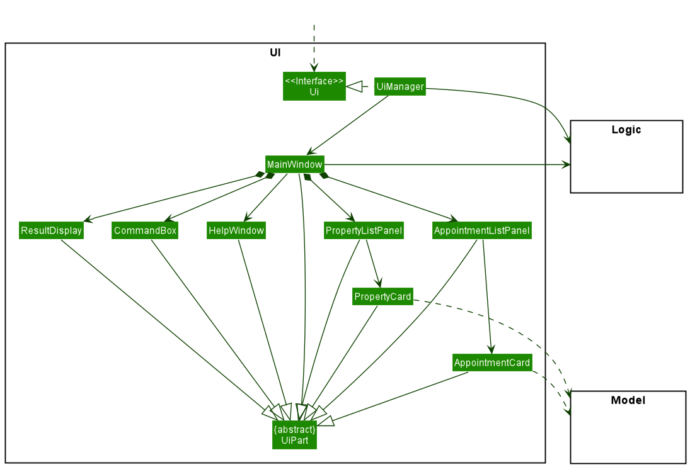
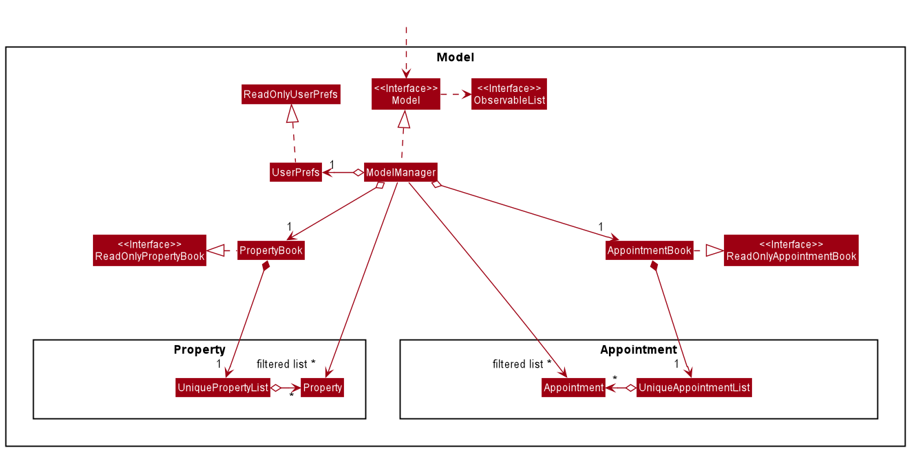
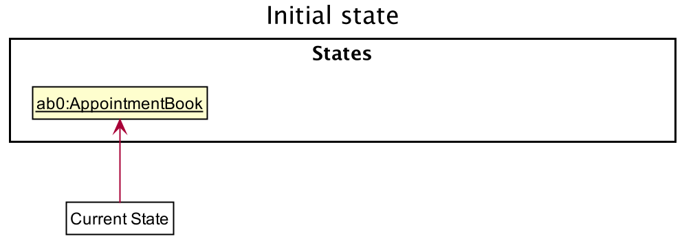
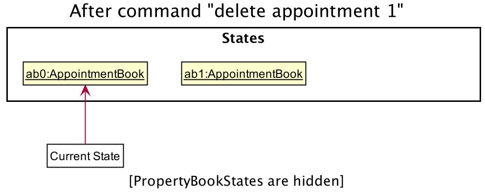
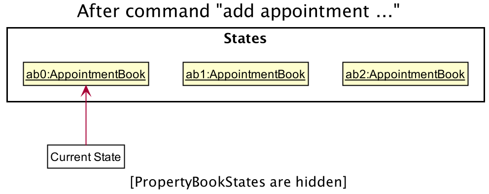
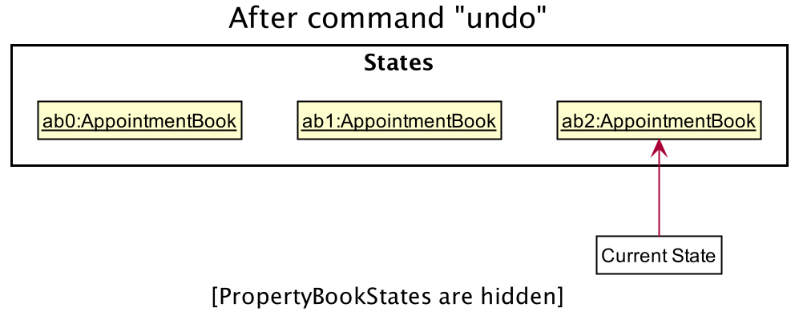
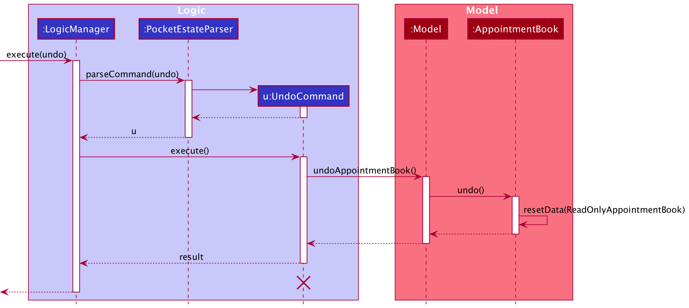
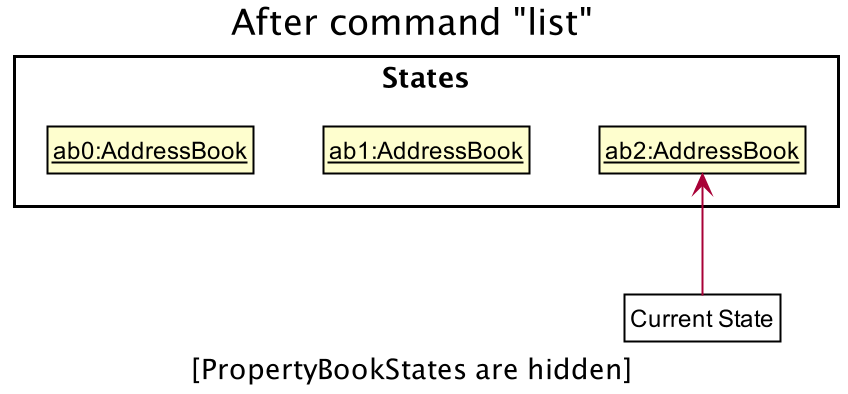
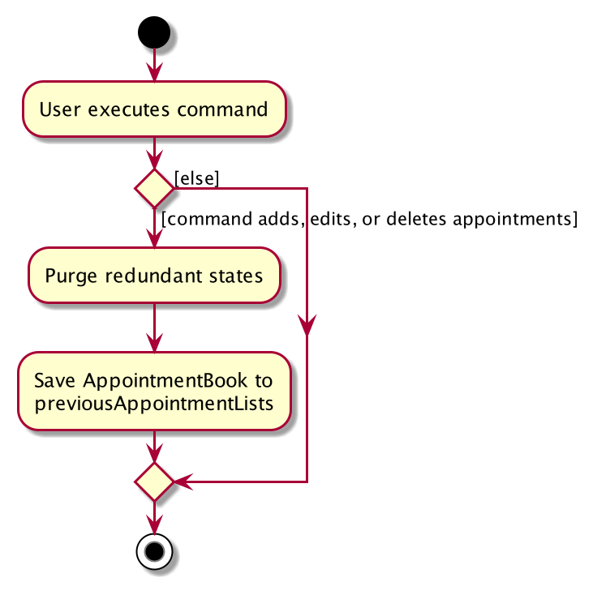

* Table of Contents
{:toc}

--------------------------------------------------------------------------------------------------------------------

## **Setting up, getting started**

Refer to the guide [_Setting up and getting started_](SettingUp.md).

--------------------------------------------------------------------------------------------------------------------

## **Design**

### Architecture

The ***Architecture Diagram*** given above explains the high-level design of the App. Given below is a quick overview of each component.

:bulb: **Tip:** The `.puml` files used to create diagrams in this document can be found in the [diagrams](https://github.com/AY2021S2-CS2103T-T13-4/tp/tree/master/docs/diagrams/) folder. Refer to the [_PlantUML Tutorial_ at se-edu/guides](https://se-education.org/guides/tutorials/plantUml.html) to learn how to create and edit diagrams.

**`Main`** has two classes called [`Main`](https://github.com/AY2021S2-CS2103T-T13-4/tp/blob/master/src/main/java/seedu/address/Main.java) and [`MainApp`](https://github.com/AY2021S2-CS2103T-T13-4/tp/blob/master/src/main/java/seedu/address/MainApp.java). It is responsible for,
* At app launch: Initializes the components in the correct sequence, and connects them up with each other.
* At shut down: Shuts down the components and invokes cleanup methods where necessary.

[**`Commons`**](#common-classes) represents a collection of classes used by multiple other components.

The rest of the App consists of four components.

* [**`UI`**](#ui-component): The UI of the App.
* [**`Logic`**](#logic-component): The command executor.
* [**`Model`**](#model-component): Holds the data of the App in memory.
* [**`Storage`**](#storage-component): Reads data from, and writes data to, the hard disk.

Each of the four components,

* defines its *API* in an `interface` with the same name as the Component.
* exposes its functionality using a concrete `{Component Name}Manager` class (which implements the corresponding API `interface` mentioned in the previous point.

For example, the `Logic` component (see the class diagram given below) defines its API in the `Logic.java` interface and exposes its functionality using the `LogicManager.java` class which implements the `Logic` interface.

**How the architecture components interact with each other**

The *Sequence Diagram* below shows how the components interact with each other for the scenario where the user issues the command `delete property 1`.

The sections below give more details of each component.

### UI component

:information_source: **Note:** Due to the limitation of PlantUML, some triangles that are used to indicate class inheritance and some solid diamonds that are used to denote composition may overlap with each other.

**API** :
[`Ui.java`](https://github.com/AY2021S2-CS2103T-T13-4/tp/blob/master/src/main/java/seedu/address/ui/Ui.java)

The UI consists of a `MainWindow` that is made up of parts e.g.`CommandBox`, `ResultDisplay`, `PropertyListPanel`, `AppointmentListPanel`, `StatusBarFooter` etc. All these, including the `MainWindow`, inherit from the abstract `UiPart` class.

The `UI` component uses JavaFx UI framework. The layout of these UI parts are defined in matching `.fxml` files that are in the `src/main/resources/view` folder. For example, the layout of the [`MainWindow`](https://github.com/AY2021S2-CS2103T-T13-4/tp/blob/master/src/main/java/seedu/address/ui/MainWindow.java) is specified in [`MainWindow.fxml`](https://github.com/AY2021S2-CS2103T-T13-4/tp/blob/master/src/main/resources/view/MainWindow.fxml)

The `UI` component,

* Executes user commands using the `Logic` component.
* Listens for changes to `Model` data so that the UI can be updated with the modified data.

### Logic component

**API** :
[`Logic.java`](https://github.com/AY2021S2-CS2103T-T13-4/tp/blob/master/src/main/java/seedu/address/logic/Logic.java)

1. `Logic` uses the `PocketEstateParser` class to parse the user's input command.
1. Depending on the command string passed in by the user,
   * a specific command parser (e.g. `AddPropertyCommandParser`) may be created to parse the input arguments to produce the corresponding `Command` object, or
   * the `Command` object can be directly created for some commands (e.g. `HelpCommand`).
1. The `Command` object is then executed by the `LogicManager`.
1. The command execution can affect the `Model` (e.g. adding a property, deleting a property).
1. The result of the command execution is encapsulated as a `CommandResult` object, which is passed back to the `Ui`. The feedback to the user is then displayed to the user.
1. In addition, the `CommandResult` object can also instruct the `Ui` to perform certain actions, such as displaying help to the user.

Given below is the Sequence Diagram for interactions within the `Logic` component for the `execute("add property n/Mayfair t/Condo a/1 Jurong East Street 32, #08-111 p/609477 d/31-12-2021")` API call.

:information_source: **Note:** The lifeline for `AddPropertyCommandParser` should end at the destroy marker (X) but due to a limitation of PlantUML, the lifeline reaches the end of diagram.

### Model component

**API** : [`Model.java`](https://github.com/se-edu/addressbook-level3/tree/master/src/main/java/seedu/address/model/Model.java)

The `Model`,

* stores a `UserPref` object that represents the user’s preferences.
* stores the address book data.
* exposes an unmodifiable `ObservableList<Person>` that can be 'observed' e.g. the UI can be bound to this list so that the UI automatically updates when the data in the list change.
* does not depend on any of the other three components.

:information_source: **Note:** An alternative (arguably, a more OOP) model is given below. It has a `Tag` list in the `AddressBook`, which `Person` references. This allows `AddressBook` to only require one `Tag` object per unique `Tag`, instead of each `Person` needing their own `Tag` object. 

### Storage component

**API** : [`Storage.java`](https://github.com/se-edu/addressbook-level3/tree/master/src/main/java/seedu/address/storage/Storage.java)

The `Storage` component,
* can save `UserPref` objects in json format and read it back.
* can save the address book data in json format and read it back.

### Common classes

Classes used by multiple components are in the `seedu.addressbook.commons` package.

--------------------------------------------------------------------------------------------------------------------

## **Implementation**

This section describes some noteworthy details on how certain features are implemented.

### \[Proposed\] Undo feature

#### Proposed Implementation

The proposed undo mechanism is facilitated by `PocketEstate`. It implements the undo feature with an undo history, stored internally as an `previousAppointmentLists` and `previousPropertyLists`. It implements

* `AppointmentBook#undo()` — Restores the previous appointment book state from its history.
* `PropertyBook#undo()` — Restores the previous property book state from its history.

These operations are exposed in the `Model` interface as `Model#undoAppointmentBook()` and `Model#undoPropertyBook()` respectively.

Given below is an example usage scenario and how the undo mechanism behaves at each step.

Step 1. The user launches the application for the first time. The `PocketEstate` will be initialized with the initial appointment book state and property book state, and the currentAppointmentBookStatePointer currentPropertyBookStatePointer pointing to the two initial book states respectively.

Step 2. The user executes `delete appointment 1` command to delete the 1st appointment in the appointment book. The `delete appointment` executes `previousAppointmentLists.push(new ArrayList<>(appointments.asUnmodifiableObservableList()))`, causing the previous state of the appointment book before the `delete appointment 1` command executes to be saved in the `previousAppointmentLists`, and the currentAppointmentBookStatePointer still points to the current appointment book state.

Step 3. The user executes `add appointment …​` to add a new appointment. The `add appointment` command also executes `previousAppointmentLists.push(new ArrayList<>(appointments.asUnmodifiableObservableList()))`, causing a copy of the current appointment book state to be saved into the `previousAppointmentLists`.

:information_source: **Note:** If a command fails its execution, it will not executes `previousAppointmentLists.push(new ArrayList<>(appointments.asUnmodifiableObservableList()))`, so the appointment book state will not be saved into the `previousAppointmentLists`.

Step 4. The user now decides that adding the appointment was a mistake, and decides to undo that action by executing the `undo` command. The `undo` command will call `Model#undoAppointmentBook()`, which will shift the `currentAppointmentBookStatePointer` to the most recently saved state, pointing it to the previous appointment book state, and restores the appointment book to that state.

:information_source: **Note:** If the `previousAppointmentLists` is empty, then there are no previous AppointmentBook states to restore. The `undo` command uses `commandHistory.empty()` to check if this is the case. If so, it will return an error to the user rather than attempting to perform the undo.

The following sequence diagram shows how the undo operation works:

Step 5. The user then decides to execute the command `list`. Commands that do not modify the appointment book, such as `list`, will usually not executes `previousAppointmentLists.push(new ArrayList<>(appointments.asUnmodifiableObservableList()))`. Thus, the `previousAppointmentLists` remains unchanged.

The following activity diagram summarizes what happens when a user executes a new command:

#### Design consideration:

##### Aspect: How undo executes

* **Alternative 1:** Saves the entire appointment/property book.
  * Pros: Easy to implement.
  * Cons: May have performance issues in terms of memory usage.

* **Alternative 2 (current choice):** Saves the entire appointment/property list in the appointment/property book.
  * Pros: Easy to implement.
  * Cons: May have performance issues in terms of memory usage.
    
* **Alternative 3:** Saves only changes made by previous commands (Similar to commit and restore in version control).
  * Pros: Will use less memory (e.g. for `delete`, may only save the appointment/property being deleted, and the deleted appointment/property is added back if the command is undone).
  * Cons: Difficult to implement, different implementations are required to restore different changes.

_{more aspects and alternatives to be added}_

### \[Implemented\] Update feature

#### Implementation

The update mechanism is facilitated by `PocketEstate`. It implements the update feature with 3 parts, the `Status` field in `Property`, a `UpdateCommandParser` and `UpdateCommand`.

The `Status` field consists of a `Status` interface with a `next()` method that returns a `Status` representing the next stage of the property selling process. There are 3 classes that implement `Status`, `Option`, `SalesAgreement` and `Completion`. Each class takes in an `Offer` which represents the price that was offered for the property.

* `Option` — Represents the stage where the buyer exercises the Option to Purchase.
* `SalesAgreement` — Represents the stage where the buyer is considering the Sales and Purchase Agreement.
* `Completion` — Represents the stage where the property has been sold.

(insert class diagram of status)

The `UpdateCommand` is assisted by 3 subcommands that extend the abstract class `UpdateCommand` which itself extends `Command`. The subcommands are, `UpdateNewCommand`, `UpdateProceedCommand` and `UpdateCancelCommand`. The subcommands help execute on the model when the user calls `u/new`, `u/proceed` or `u/cancel` respectively. 

* `UpdateNewCommand` — Takes in an `Index` and an Amount to create a new `Status` with the given Amount for the property at the given `Index`.
* `UpdateProceedCommand` — Takes in an `Index` and moves the `Status` of the property at the given `Index` to the next `Status` if applicable.
* `UpdateNewCommand` — Takes in an `Index` and removes the `Status` of the property at the given `Index` if applicable.

(insert class diagram of UpdateCommand)

Given below is an example usage scenario and how the update mechanism behaves at each step.

Step 1. The user launches the application for the first time. The `PocketEstate` will be initialized with the initial appointment book state and property book state.

Step 2. The user executes `update 1 u/new 600,000` command to add a new status with value 600,000 to the first property.

(some object diagram?)

Step 3. The user executes `update 1 u/proceed` to move the `Status` of the first property to `SalesAgreement`.

(some object diagram?)

Step 4. The user executes `update 1 u/proceed` to move the `Status` of the first property to `Completion`.

(some object diagram?)

Step 5. The user then decides that having the `Completion` status on the first property was a mistake and executes the command `update 1 u/cancel`.

(some object diagram?)

#### Design consideration:

##### Aspect: How undo executes

The following activity diagram summarizes what happens when a user executes an `UpdateCommand`:

(insert overall update activity diagram here)

(insert UpdateCommandParser activity diagram here)

The following sequence diagram shows how the update operation works:

(insert update new activity diagram here)

### \[Proposed\] Data archiving

_{Explain here how the data archiving feature will be implemented}_

--------------------------------------------------------------------------------------------------------------------

## **Documentation, logging, testing, configuration, dev-ops**

* [Documentation guide](Documentation.md)
* [Testing guide](Testing.md)
* [Logging guide](Logging.md)
* [Configuration guide](Configuration.md)
* [DevOps guide](DevOps.md)

--------------------------------------------------------------------------------------------------------------------

## **Appendix: Requirements**

### Product scope

**Target user profile**:

* property agent who has a need to manage a significant number of properties and appointments
* prefer desktop apps over other types
* can type fast
* prefers typing to mouse interactions
* is reasonably comfortable using CLI apps

**Value proposition**: PocketEstate enables easy organization of mass clientele property information through sorting of information by price, location and housing type, that may otherwise be difficult to manage.

### User stories

Priorities: High (must have) - `* * *`, Medium (nice to have) - `* *`, Low (unlikely to have) - `*`

| Priority | As a …​                                 | I want to …​                                                            | So that I can…​                                                                |
| -------- | ------------------------------------------ | -------------------------------------------------------------------------- | --------------------------------------------------------------------------------- |
| `* * *`  | new user                                   | see usage instructions                                                     | refer to instructions when I forget how to use the App                            |
| `* * *`  | user                                       | be able to add a property                                                  | keep track of my clients' properties                                              |
| `* * *`  | user                                       | be able to add an appointment                                              | keep track of my upcoming schedule                                                |
| `* * *`  | user                                       | list all properties on sale                                                | know the number of properties that I have to sell                                 |
| `* * *`  | user                                       | list all properties on sale                                                | know which properties I have to sell                                              |
| `* * *`  | user                                       | view the client asking price of a property                                 | keep the price in mind when negotiating with the buyer                            |
| `* * *`  | user                                       | view the properties in the order of nearest deadline                       | prioritize selling properties with a more urgent deadline                         |
| `* *`    | potential user exploring the app           | see the app populated with sample data                                     | easily see how the app looks like when it is in use                               |
| `* *`    | careless user                              | be able to categorize housing information based on predefined tags         | prevent typos while keying in information and avoid storing the wrong information |
| `* *`    | user                                       | update the status of property listings(completed, Option, Sale Agreement)  | follow up with clients on time                                                    |
| `* *`    | user                                       | edit the deadline of the property listing                                  | extend the time period for selling the property                                   |
| `* *`    | user                                       | edit the name of the property listing                                      | change the name of the property when I have made a mistake                        |
| `* *`    | user                                       | edit the address of the property listing                                   | change the address of the property when I have made a mistake                     |

*{More to be added}*

### Use cases

(For all use cases below, the **System** is the `PocketEsate` and the **Actor** is the `user`, unless specified otherwise)

**Use case: UC01 - Add a property**

**MSS**

1. User request to add a property
2. PocketEstate shows an updated list of properties

   Use case ends.

**Extensions**

* 1a. The property to be added has missing required fields.

    * 1a1. PocketEstate shows an error message.

      Use case ends.

**Use case: UC02 - Add an appointment**

**MSS**

1. User request to add an appointment
2. PocketEstate shows an updated list of appointments

   Use case ends.

**Extensions**

* 1a. The appointment to be added has missing required fields.

    * 1a1. PocketEstate shows an error message.

      Use case ends.

**Use case: UC03 - Listing all properties and appointments**

**MSS**

1. User requests to list all properties and appointments.
2. PocketEstate shows the entire list of properties and appointments.

    Use case ends.

**Extensions**

* 3a. List command used has unrecognized fields.

    * 3a1. PocketEstate shows an error message.

      Use case ends.

**Use case: UC04 - Edit a property**

**MSS**

1. User request to edit a property
2. PocketEstate shows an updated list of properties

   Use case ends.

**Extensions**

* 1a. The property to be edited has unrecognized fields.

    * 1a1. PocketEstate shows an error message with the unrecognized fields.

      Use case ends.

**Use case: UC05 - Edit an appointment**

**MSS**

1. User request to edit an appointment
2. PocketEstate shows an updated list of appointments

   Use case ends.

**Extensions**

* 1a. The appointment to be edited has unrecognized fields.

    * 1a1. PocketEstate shows an error message with the unrecognized fields.

      Use case ends.

**Use case: UC06 - Update status of a property**

**MSS**

1. User request to update status of a property
2. PocketEstate shows an updated list of properties

   Use case ends.

**Extensions**

* 1a. The property to be updated has incorrect fields.

    * 1a1. PocketEstate shows an error message.

      Use case ends.

**Use case: UC07 - Searching for property**

**MSS**
1. User requests to search for properties of a certain type.
2. PocketEstate shows a list of properties that are of that type.

    Use case ends.

**Use case: UC08 - Searching for appointment**

**MSS**
1. User requests to search for appointments with a certain person.
2. PocketEstate shows a list of all appointments with that person.

    Use case ends.

*{More to be added}*

### Non-Functional Requirements

1. Should work on any _mainstream OS_ as long as it has Java `11` or above installed.
2. A user with above average typing speed for regular English text (i.e. not code, not system admin commands) should be able to accomplish most of the tasks faster by using commands over the mouse.
3. Should be able to hold up to 500 properties and 500 appointments concurrently without a noticeable sluggishness in performance for typical usage.
4. The app should respond within two seconds after each user command.
5. The GUI of the app should clearly differentiate the different property types (HDB , Condo , Landed , etc.) of each property in the list.
6. The app should be able to run without internet connection.
7. The app should be resizable and can be enlarged to the maximum window width.
8. There should be sample data in the app when the user opens the app for the first time.

*{More to be added}*

### Glossary

* **Mainstream OS**: Windows, Linux, Unix, OS-X
* **Private contact detail**: A contact detail that is not meant to be shared with others
* **Property**: A property listing with mandatory attributes: Name, Property type, Address, Postal code and Deadline,
    optional attributes: Client name, Client contact, Client email, Client asking price, Remarks
* **Appointment**: An appointment listing with mandatory attributes: Name, Remarks, Date,  optional attribute: Time

--------------------------------------------------------------------------------------------------------------------

## **Appendix: Instructions for manual testing**

Given below are instructions to test the app manually.

:information_source: **Note:** These instructions only provide a starting point for testers to work on;
testers are expected to do more *exploratory* testing.

### Launch and shutdown

1. Initial launch

   1. Download the jar file and copy into an empty folder

   1. Double-click the jar file Expected: Shows the GUI with a set of sample contacts. The window size may not be optimum.

1. Saving window preferences

   1. Resize the window to an optimum size. Move the window to a different location. Close the window.

   1. Re-launch the app by double-clicking the jar file. 
       Expected: The most recent window size and location is retained.

1. _{ more test cases …​ }_

### Deleting a person

1. Deleting a person while all persons are being shown

   1. Prerequisites: List all persons using the `list` command. Multiple persons in the list.

   1. Test case: `delete 1` 
      Expected: First contact is deleted from the list. Details of the deleted contact shown in the status message. Timestamp in the status bar is updated.

   1. Test case: `delete 0` 
      Expected: No person is deleted. Error details shown in the status message. Status bar remains the same.

   1. Other incorrect delete commands to try: `delete`, `delete x`, `...` (where x is larger than the list size) 
      Expected: Similar to previous.

1. _{ more test cases …​ }_

### Saving data

1. Dealing with missing/corrupted data files

   1. _{explain how to simulate a missing/corrupted file, and the expected behavior}_

1. _{ more test cases …​ }_
